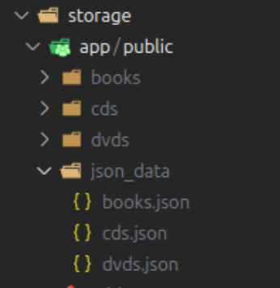
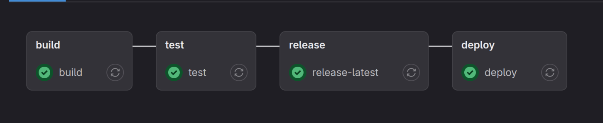

# ISD_ICT_20232_147822_nhom_22

## group members:

- Nguyen Huu Dat 20215192
- Le Tuan Anh 20205141
- Mai Hoang Anh 20205142
- Ngo Xuan Bach 20205144
- Nguyen Thanh Dat 20205178

## Feature:

#### Customer

- Register/Login
- View list of products
- View product
- Add to cart
- View cart
- Place order (COD/VNPAY)

#### Manager

- View all products
- Create, update (**only 2 times** per day for each product), delete product (**maximum 5** products per day), restore products
- View history of product's actions
- Confirm/reject order
- Confirm/reject delivery
- Send email (comming soon)

#### Admin

- All the same permission as manager
- Create user, change user's role, block user (comming soon)

### Note: the vnpay info for testing is inside **./Media_store/vnpay_bank_info.txt**

# How to run?

## Requirement

Make sure you already install docker, docker compose and wsl2 (if you are using window)

If not, following this guide: https://docs.docker.com/engine/install/

### Navigate to Media_store

~$ cd Media_store

### Create .env file and config the following content:

~$ cp .env.example .env

"""APP_NAME=Laravel
APP_ENV=dev
APP_KEY=
APP_DEBUG=true
APP_TIMEZONE=UTC
APP_URL=http://localhost:8000

DB_CONNECTION=mysql
DB_HOST=db
DB_PORT=3306
DB_DATABASE=media_store
DB_USERNAME=media_user
DB_PASSWORD=password"""

...

### Build project

~$ docker compose build app --no-cache

~$ docker compose up -d

### Install composer

~$ docker compose exec app rm -rf vendor composer.lock

~$ docker compose exec app composer install

### Install npm and build the manifest.json

~$ docker compose run --rm npm install

~$ docker compose run --rm npm run build

### Generate app key

~$ docker compose exec app php artisan key:generate

## Important

> Before seeding data, you must to unzip the data.zip inside /Media_store/storage/app/
> The dir must be look like this:

Run following command to seed data:

~$ docker compose exec app php artisan storage:link

~$ docker compose exec app php artisan migrate:fresh --seed

## Now application is running at http://localhost:8000

## Phpmyadmin already at http://localhost:8888

# Production

> I have setup gitlab CICD pipeline that include:

> What does it has? Build app, automation test with PEST, release image and finally auto deployment
> Now you can visit my website at:
> https://daicy.shop

You can test for the VNPAY feature by the following infomation:
"""
Ngân hàng:
NCB
Số thẻ:
9704198526191432198
Tên chủ thẻ:
NGUYEN VAN A
Ngày phát hành:
07/15
Mật khẩu OTP:
123456
"""

### Visit my gitlab: https://gitlab.com/bereftHeart/cicd
